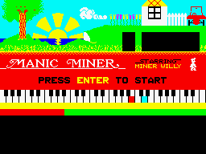

gd2-manicminer
==============

Manic Miner port for Gameduino 2

To play, copy ``manicminer/`` into your Arduino sketchbook. All the graphics are built into the game, so there is nothing to load on the microSD card.

The graphics are built by the tools in ``graphics/``. See the README in that directory for details.
